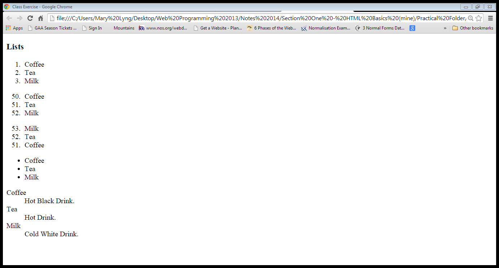
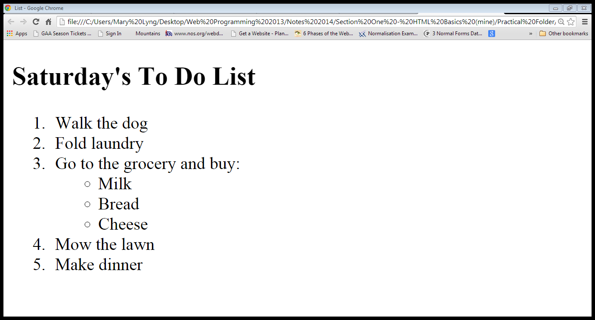

##Adding lists: Exercises

###Exercise One

- Create a folder called 'Lab03' in your WebsiteDevelopment1/Week01 folder. 
- Open a text editor and create a new web page called ListExercise1.htm. Save it into the Lab03 folder.
- Include the required tags to create the following web page which includes some lists:

- Remember to use `<ul>` for unordered lists, `<ol>` for ordered lists, and `<dl>` for description lists. Each list item in an unordered or ordered list is marked up with a `<li>` tag.
- Don't forget to add all the usual HTML tags that should be on every page (html, head, title, body, etc.)

###Exercise Two

- Open a text editor and create a new web page called ListExercise2.htm.  Save it into the Lab03 folder.
- Include the required tags to create the following web page which includes a nested list:

