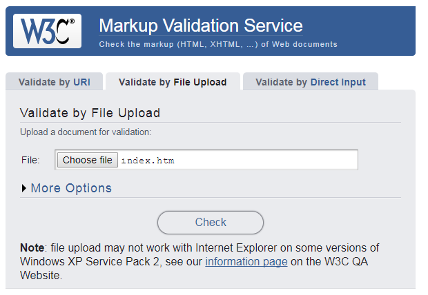

##The World Wide Web Consortium (W3C)

The World Wide Web Consortium (W3C) is an international community that develops open standards to ensure the long-term growth of the Web. Member organizations, a full-time staff, and the public work together to develop Web standards. Led by Web inventor Tim Berners-Lee and CEO Jeffrey Jaffe, W3C's mission is to lead the Web to its full potential.

The W3C provide online validation tools that you allow to check whether your HTML code complies with the standard they have set. You will try out this tool in this lab.

##HTML Validator

- To use the validator, go to <a href="https://validator.w3.org/" target="_blank">`https://validator.w3.org/`</a>. 

- Once there, you have three options:

  - Validate by URI: enter a URL/web address to check the HTML on that webpage.
  
  
  
  - Validate by file upload: Click on choose file and find the HTML file you want to check, wherever you have saved it.
  
  
  
  - Validate by direct input: Copy and paste the HTML you want to check into the box provided.
  
  

  
###Common errors

- Opening or closing tag missing: for example, you may have two opening `
` tags and only one closing `
` tag. The validator will spot these and should also tell you roughly what line the error occurs on. 
- <b>Tip!</b> Sometimes the error is actually on the line <i>above</i> the one that the validator suggests!
- Tags nested incorrectly: for example, these tags are nested incorrectly `
<b>Text
</b>`  Tags should be closed in the opposite order from how they were opened. In this example, the bold element should be fully enclosed in the paragraph element, like this: `
<b>Text</b>
`
- Doctype, language code or charset missing: You may have noticed in our labs we have been including some extra lines in our code: these are required for correct validation. You can see these in the code below:

~~~
<!DOCTYPE html>
<html lang="en">
<head>
  <meta charset="UTF-8">
  <title>WIT Home Page</title>
 </head>
 <body>
  Waterford Institute of Technology
  WIT Home Page
  
Waterford Institute of Technology (WIT) is a university-level institution in the South-East
     of Ireland with over 10,000 students and 1000 staff. 

  
WIT offers tuition and research programs in various areas up to PhD level.

   </body>
  </html>
~~~

  - `<!DOCTYPE html>`: this tells the browser what language we are using (HTML)
  - `<html lang="en">`: adding the language attribute to the HTML tag sets the language of the page as English (en).
  - `<meta charset="UTF-8">`: including this line in the head section tells the browser what character set we are using (UTF-8).