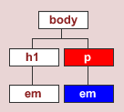
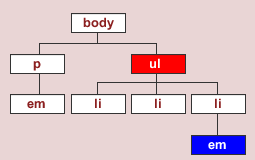

#What are Descendant Selectors?

Descendant selectors are used to select elements that are descendants of another element in 
the document tree.

For example, you may wish to target a specific  *em* element on the page, but not all  *em*  elements. A sample document could contain the following code:

~~~
<body>
 <h1>Heading<em>here</em></h1>
 
Lorem ipsum dolor<em>sit</em>amet.

</body>
~~~

The document tree diagram (with the  *em*  element to be targeted) would be:

 

If you use a type selector like the example below, you will select all  *em*  elements on the page:

~~~
em  {color: blue; }
~~~

However, if you use a descendant selector, you can refine the  *em*  elements that you select. The rule below will only select  *em* elements that are descendants of  *p*  elements.
If this rule is applied, the  *em*   element within the *p* element will be coloured blue, and the  *em*   element within the *h1* element will not be coloured blue.

~~~
p em  {color: blue; }
~~~

You can also jump levels in the document tree structure to select descendants. For example, the following code:

~~~
<body>
 
Lorem ipsum dolor<em>sit</em>amet.

 <ul>
  <li>item 1</li>
  <li>item 2</li>
  <li><em>item 3</em></li>
 </ul>
</body>
~~~

The document tree (with a third-level  *em*   element highlighted) would be:

 

Using the following rule you can isolate any  *em*   element inside a  *ul*   element, without having to describe the  *li*   element. If this rule is applied, any  *em*   element within a  *ul*  element will be coloured blue. However, the  *em*   element within the  *p*   will not be coloured blue:

~~~
ul em  {color: blue; }
~~~

Composed of two or more selectors separated by whitespace, descendant selectors apply styles to elements that are contained within other elements.

In the following <a href = "archives/Class Htmls/contextualsample.htm" target = "_blank">example</a> a tan background is displayed behind text when there is an  *i* tag nested within the  *p*  tag.  
Likewise, a yellow background is displayed behind text when there is a *strong* tag within an *i* tag that is within a *p* tag.

~~~
/* two selector example */
p i {background: tan;}

/* three selector example */
p i strong {background: yellow;}
~~~

See another <a href = "archives/Class Htmls/contextualsample2.htm" target = "_blank">Example</a>. There is a gray division defined
in the body. When a  *h1*  tag appears within this division, it assumes a yellow font colour. Likewise, when
a  *p* tag appears within this division, it assumes a red font colour and is displayed in bold.
