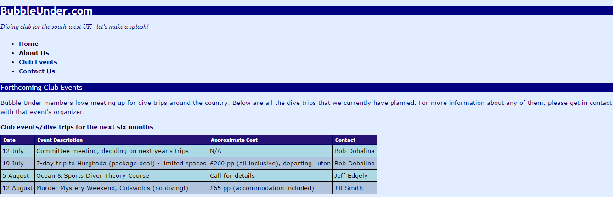

# HTML Tables Exercise One

1. For this Exercise you need to download [Lab03](archives/Lab03.zip).	
2. In **events.html**, add a table as specified below after the paragraph.
3. Add the following style rules to the *.css* file **style.css**:
   1. A group selector for table, th and td: a solid black border (1px width).
   2. A group selector for th and td: padding of .3em.
   3. table: collapsed border.
   4. th: extra small font size; aligned to the left; background colour: hex 241374; colour: hex ffffff; border colour: hex 000066; padding: 0 .5em;
   5. td: small font size.
   6. caption: colour: hex 000066; small font size; bold font weight; aligned to the left; bottom padding: .5em
   7. Select the even rows: background colour: hex ADD8E6.
   8. Select the odd rows: background colour: hex B0C4DE.

