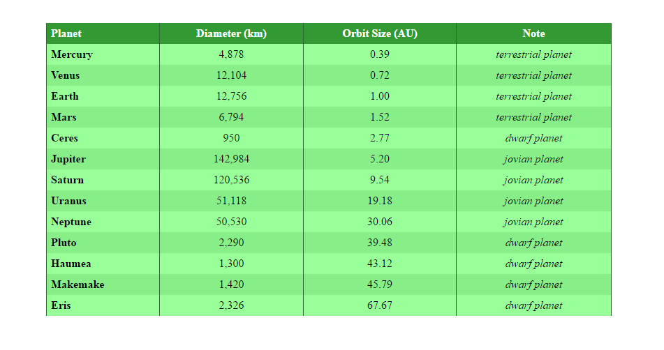

# HTML Tables Exercise Two

1. For this Exercise you need to download [Lab04](archives/Lab04.zip).
2. A table has been created for you, now add style to **table.css** as follows:
   1. The table is 60% wide, has a margin of 5%  auto, and the table the borders are collapsed.
   2. The table headings (th), and table data (td) have a border left and right of 1px solid hex 336633. There is also padding of .4em.
   3. The thead element has a background colour of hex 339933 and a colour of white.
   4. The table data inside the tbody element is centered.
   5. The third table data element inside the tbody element has an italic font style.
   6. The even rows inside the tbody element have a background colour of hex 88ee88.
   7. The odd rows inside the tbody element have a background colour of hex 99ff99.
   8. The first table heading inside the thead element and the table headings inside the tbody element are aligned to the left.
   9. Add a hover for each row inside the tbody element of background colour hex 339933.

