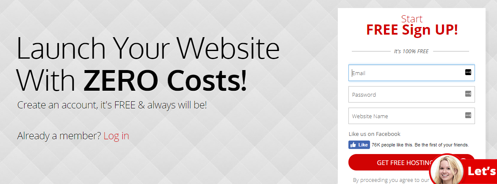
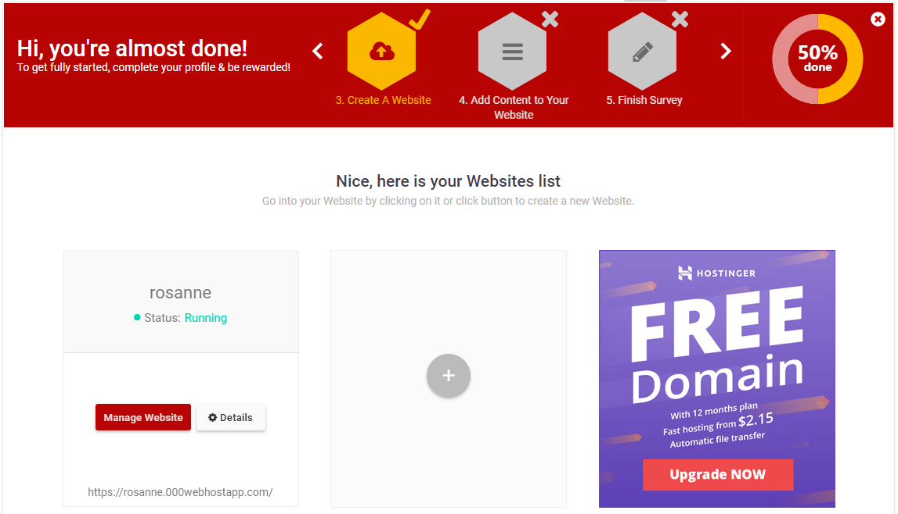

#Create an account with 000webhost

Go to <a href="http://www.000webhost.com" target="_blank">`http://www.000webhost.com`</a> and select the Free Hosting option. Click on Sign up for free.

Next, add your email, a password of your choosing, and a name for your website. 

When asked, select the "It's ok, I want to learn" option.

Next, you will need to verify your email address. Check the email address that you provided and click the link to verify that you have signed up for 000webhost's services.

Once you have completed this step, you should see the status of your website is "running". 

In the next step, we will add files to our website. To create a second website you can click the plus button in the centre of the screen. 000webhost allows two free websites on their unpaid account.