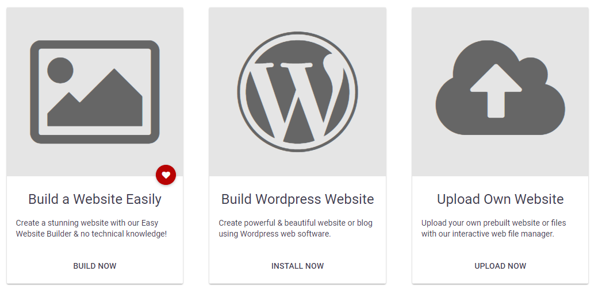
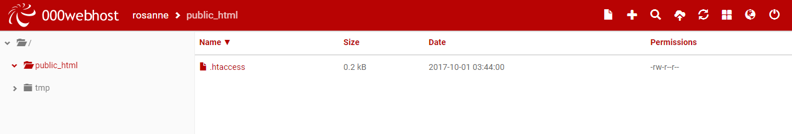
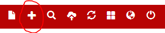
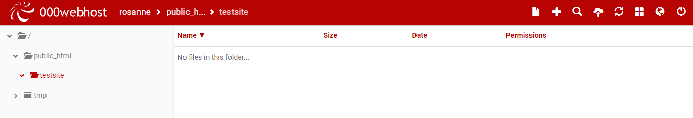

#File Manager

In 000webhost, you can see the website that has been created using the name you gave when you signed up. We will now add files to this site. Click on the 'Manage Website' button.

There are three options, including a website builder and a Wordpress option. However, we will upload our own files. Click on the 'Upload Own Website' option.

This will bring you to the 000webhost file manager. When it opens, you will see there is a folder already created called public_html. All of our files need to be placed within this folder. 

Click the plus icon (on the top right) to add a new folder. Name the folder 'testsite'.

You should now see your testsite folder within the public_html folder. Double-click to get inside the testsite folder.

In the next step, we will add files to this folder. 