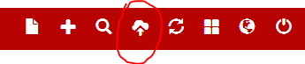
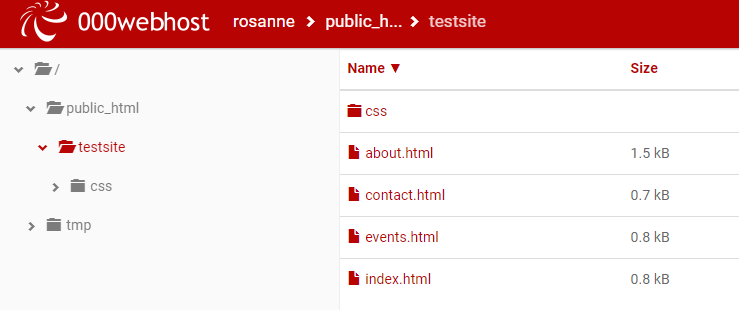
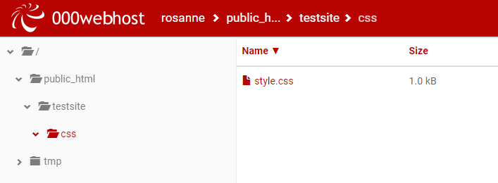

#Upload files

The website we are going to upload is in this zip file: [testsite.zip](archives/testsite.zip). Create a new folder in your student G: Drive called Week05 and save this zip file there. Extract (unzip) the contents. You will see a folder called testsite: it contains four HTML files, a subfolder called css and a CSS file. 

##Adding files in 000webhost

Back in the 000webhost File Manager, click the upload files icon (on the top right) to add files. 

Find the testsite folder. Select the HTML pages for upload; you can use Shift+Click to select all four in one go.

Next, create a folder (plus icon on the top right) called css within the testsite folder. Upload the style.css file into the css folder. 

Your file and folder structure on 000webhost should mirror the structure of the files and folders on your own computer; it's very important that they match exactly. At the end of this process, your testsite folder should have these contents:

And the css folder should have these contents:

In the next step, we'll view our website. 