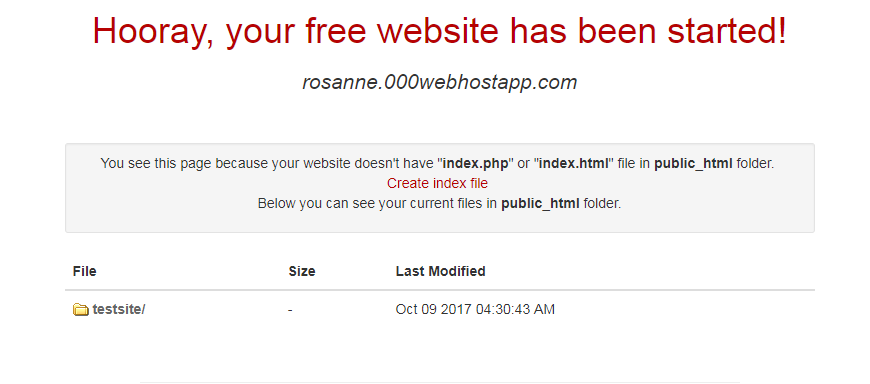

#View your website

Once you are finished uploading files, you can leave the File Manager area (just close the tab/window) and go back to the main 000webhost dashboard. 

You will see a link to your website in red text on this screen e.g. rosanne.000webhostapp.com. Click it to view your website.

Because we don't have any files directly in the public_html folder, we will see the following message:

We can click on the testsite folder to view our test website. Alternatively, we can go directly there in the browser by adding /testsite at the end of the web address e.g. rosanne.000webhostapp.com/testsite. 

You should now see your test website, which looks as follows:

Congratulations! You just deployed your first website. Now try the exercises in the next step, where you will add some extra content.