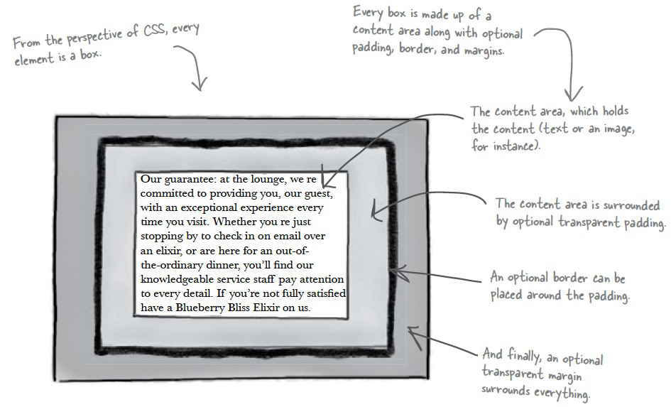

# The Box Model, padding and margins

CSS has the concept of a box model that essentially is a box that wraps around HTML elements. Each box has a content area (e.g. text, an image, a heading) and optional surrounding padding, border, and margin areas. This allows us to place a border around elements and space elements in relation to other elements. From the inside out it is ordered like so:

content -> padding -> border -> margin


So in our case anything in between our tags is the 'content'. Right after that comes the padding. Then there is a border and, finally, a margin. Margin and padding may seem like the same thing but if you think about it, you can see how being able to control the space before the border (padding) and after the border (margins) can really effect your layouts.


## Padding

The CSS padding properties define the space between the element border and the element content. Padding is an inner, invisible border around your element.

<a href='archives/examples/padding.htm' target='_blank'>Padding Example</a>

## Margins

The CSS margin properties define the space around elements. The margin clears an area around an element (outside the border). The margin is an outer, invisible border around your element. The default value for the margin properties is auto.

<a href="archives/examples/margins.htm" target="_blank">Margin Example</a>



## Specifying the Measurements

### Which Unit is Best?

Question: Should we use pixels, ems or percentages?

Answer: It depends on how you want the design to behave.

- If you want the design to change with the browser window, then percentages is the way to go. The bigger the browser window; the bigger the padding or margin will become.
- If you want the design to scale well with different font sizes, then you should use ems, because the measurements will be based on the font size in their browsers.
- If you're after a precise design with graphical elements that line up exactly regardless of a browser window size or font setting, then setting sizes in pixels is the most reliable method of all. A pixel will always represent a single dot on the user's screen.

### Specifying the Properties
We can use individual values such as padding-left; padding-right; padding-top; padding-bottom; margin-top; margin-bottom; margin-left; margin-right. Or we can specify the properties using the shorthand method (e.g: margin:2em;). We can specify 1 value, 2 values, 3 values or 4 values.

```css
h1 {
  padding: 10px;
}
/*The padding will be 10px on all four sides.*/


h1 {
  margin: 10px 5px;
}
/*Top and bottom margin will be 10px, left and right margin will be 5px.*/


h1 {
  padding: 10px 5px 15px;
}
/*Top padding will be 10px, left and right padding will be 5px, bottom padding will be 15px.*/


h1 {
  border-width: 10px 5px 15px 20px;
}
/*Top border will be 10px, right border will be 5px, bottom border will be 15px, left border will be 20px.*/
```
