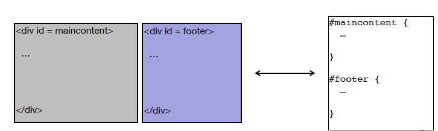
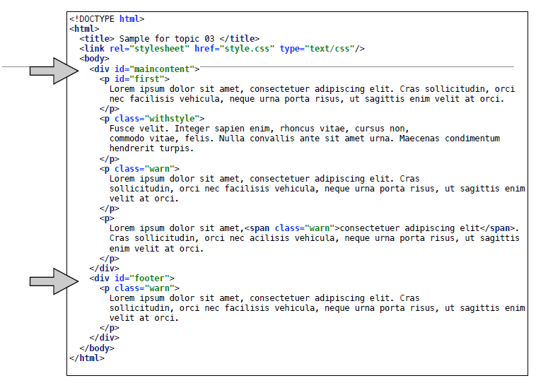
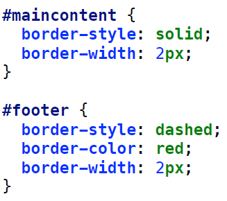
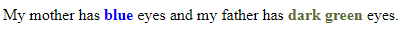

#The `
` and `` elements

The `
` and `` elements are both used for grouping other elements. They don't have any inherent meaning in themselves and don't immediately make your HTML page look any different. However, by using these elements, we can group other elements together for the purposes of layout and/or styling.

##The `
` element

The `
` tag is a **block** element (i.e. it is automatically placed on a new line by the browser) and is used to group content such as paragraphs, headings, images and tables. It can be thought of as a **container** for other content.

The HTML and CSS to create and style a `
` would be something like the following:

This is how the code for the HTML page would look:

And the CSS would look like this:

##The `` element

The `` element is an **inline** element (i.e. does not start a new line) and is used to group inline elements in a document. The `` tag provides no visual change by itself, but provides a way to add some styles to a part of a text or a part of a document.

Span example:
~~~

My mother has 
	blue 
    eyes and my father has 
    dark green 
    eyes.

~~~

Result of the above code:
