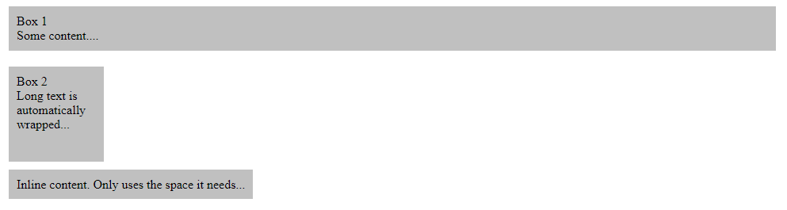

#Width and height

All elements on a webpage have dimensions. Sure, you don't have to specify them, thanks to the fluid layout model used by default - elements take up the space they need, and if there's not enough room for them, they are automatically pushed into a direction with more available space. This all happens thanks to the fact that the width and height properties of an element is set to "auto" by default, meaning that the element will automatically expand or subtract depending on the content within it.

You should be aware of the difference between inline and block elements, when it comes to dimensions, because they will behave differently: By default, an inline element will only consume the vertical and horizontal space needed to fit the content. A block element, on the other hand, will use all of the available horizontal space but only the vertical space needed to fit the content. Therefore, only block level elements can have custom widths and heights specified as illustrated in the following <a href="archives/examples/dimension1.htm" target="_blank">example</a>.

If you try out this example, you can see how the first box uses all available horizontal space, while the second box only use the 100 pixels we assign it in both directions. Div elements are by default block level elements. Note that I have only specified width and height for box1 as auto to illustrate the difference - these are already the default values, so they may be omitted. 

The last element is a span tag, which is by default an inline element and as you can see, it only uses the space actually required. You could try assigning a width and a height to it, but the browser would ignore it - only block level elements can have custom widths/heights.

##Relative and absolute width/height

We already saw how we could define widths and heights as an absolute value, in pixels, but that is just one of many options. The width and height properties can take either a length or a percentage value, meaning that you can use both absolute values (as we did with pixels) or relative values, either as a percentage of the available space or relative e.g. to a font size (i.e. the em unit ).

In this <a href="archives/examples/dimension2.htm" target="_blank">example</a>, we will see how we can use percentage values to take up a relative share of the available space.
~~~
#parent-box {
        width: 300px;
        height: 300px;
}

#box1 {
        width: 25%;
        height: 75%;
}

#box2 {
        width: 75%;
        height: 25%;
}
...

        

                Box 1 
                Some content....
        

        

                Box 2 
                Long text is automatically wrapped, if needed...
        

~~~

In this example, we have a box with an absolute size acting as a parent box, and inside of it, we have two smaller boxes, which uses a relative amount of the available parent space, just to show you how easy it is to do.

##Minimum and maximum width/height

Another possibility exists for Width and Height properties - specifying minimum and/or maximum sizes. For this purpose, four properties exist: min-height, max-height, min-width and max-width.

Specifying minimum and/or maximum sizes for an element allows you to take advantage of the fluid nature of elements on a webpage, allowing a certain element to expand and subtract within a limited set of dimensions, instead of defining a constant and absolute size like we did with the height and width properties. Just like width and height, the min-* and max-* properties allows you to specify an absolute or relative length unit or a percentage based size.

###Minimum width and height

Using the min-width and min-height properties, you can define the smallest possible size that an element can have. If the element doesn't have width and/or height defined (auto), or if these values are smaller than the defined minimum height and width, the minimum height and width values will overrule it.

In this <a href="archives/examples/dimension3.htm" target="_blank">example</a>, notice how the second box is bigger by default, even though width and height is originally set to 50px - in this case, the min-width and min-height values take precedence. 

Now look at the third box. It has more content than the second, and while the minimum values would normally allow it to grow, the fact that it has now outgrown both its height and min-height values caps it at the biggest value of the two (80px). If we want to allow it to grow beyond this, the height and/or width should not be defined. We illustrated this with the fourth box, where we reset the height value to auto, which is the default value, if it wasn't set by the .box selector - with that in place, the element is now allowed to grow vertically to make room for the content.

~~~
.box {
        width: 50px;
        height: 50px;
        background-color: DarkSeaGreen;
        padding: 10px;
        margin: 20px;
        float: left;
}
...

        Box 1 - Default

        Box 2 - Minimum height and width

        Box 3 - Minimum height and width. Only expands to 80px.

        Box 4 - Minimum height and width. Only expands to 80px, unless
        no max-height/height have been specified (auto)

~~~

###Maximum width and height

Sometimes you want to restrain an element to a specific width and/or height. Obviously this can be done with the width and height properties, but this will force the element to stay at this size all of the time - no matter if the content requires it or not. By using the max-width and/or max-height properties instead, you can allow an element to be whatever size it requires to fit the content and then grow along with the content up until a certain point.

Here's an <a href="archives/examples/dimension4.htm" target="_blank">example</a> where we use max-height and max-width. Notice how each of the three boxes act differently, depending on whether or not max values are specified and how much space the content requires.

~~~
.box {
        background-color: DarkSeaGreen;
        padding: 10px;
        margin: 20px;
        float: left;
}
...

        Box 1 - Default

        Box 2 - Maximum height and width

        Box 3 - Maximum height and width, this time with more content

~~~