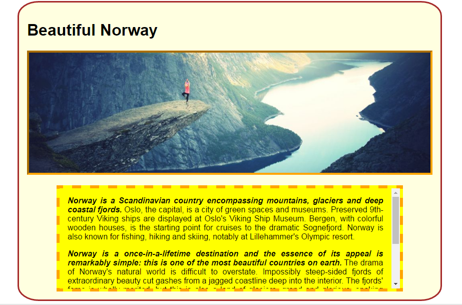

#Exercise

The goal is to create a webpage that looks like the screenshot below. It will involve using borders, margin, padding, width, height, and overflow. Download [lab01.zip](archives/lab01.zip) and unzip it into your Week 7 folder.

##On the index.html page:

Create a div for all of the page content and assign it an id called 'container' (i.e. `
`).

##In the style.css file

###container div styles

- Centre the container div in the middle of the page.
- The container div should be 60% wide.
- Background colour is light yellow. 
- Border is solid brown and 3px.
- Padding of 1em on all sides.
- The border radius is 5% on all sides.

###image styles

- The picture has a width of 99%.
- Height is auto. 
- Border is inset orange and 4px.

###text div styles

- 80% wide.
- 200px high.
- Centered inside the parent div.
- Background colour is light yellow.
- Top margin of 1em.
- Padding (Top and Bottom: 0; Left and Right: 1em;)
- Border is dashed orange and 6px.
- Text is justified.
- Overflow is handled automatically.

###important span styles

- Font weight is bold.
- Font style is italic.