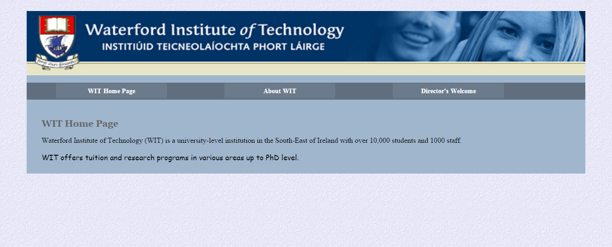

#Exercises

##Exercise One: Adding background images

- Download and unzip [lab04.zip](archives/lab04.zip).
- Open index.htm.
- In the header structural element, remove the h1 tag and content.
- Repeat the above step for the other 2 files, aboutwit.htm,  and director.htm.
- Open mycss.css in the css subfolder.
- Replace the header selector with the following: 
  
~~~                   
	header {
		 height:140px;
	}
~~~
        
- Add css rules to the header selector that will add a background image of banner.jpg and size it within the header structural element.
- Add a background image (lblue.gif) to the body selector also.
- Your finished pages should look like this:

##Exercise Two: Adding a background gradient

- Continue with the files you used in Exercise One above.
- Replace the background image on the body selector with a linear gradient.
- Use the following colour stops: #092b60 and #bec5d1.
- Set the direction of the gradient to go towards the bottom right.
- Don't forget to specify a plain background colour for browsers that don't support gradients: use #092b60.

