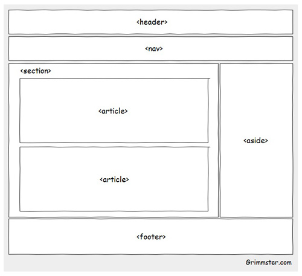

# Semantic Structural Elements

In some of the earlier examples, divs and other structural elements are being used. Recall, a `
` tag is used to divide up a web page and, in doing so, to provide a definite structure that can be used to great effect when combined with CSS. The `
` tag is a powerful generic element well suited for being used as a container within a Web page.

Structural elements are the block level elements we use to structure pages. These include:

- `<header>`: Used to contain the header content of a site. It’s used for the top part of a web page and usually contains things like logo, name, search bar and the main site navigation.

- `<footer>`: Contains the footer content of a site. It’s used typically at the bottom of the page and should contain information about the section it belongs to. For example, on a web site it can hold information about the website, author, copyright, terms and conditions.

- `<nav>`: Contains the navigation menu, or other navigation functionality for the page. It’s used for the navigational content. According to the HTML5 specification only the main navigation links should be part of this element.

- `<article>`: Identifies major sections of content within a web page. Think of a blog, where each individual post constitutes a significant piece of content. Contains a standalone piece of content that would make sense if syndicated as an RSS item, for example a news item. It’s used for independent blocks of content, such as a forum post, a magazine article, a blog entry, or a user comment.

- `<section>`: Identifies significant portions of the content on the page. This tag is somewhat analogous to dividing a book into chapters. Used to either group different articles into different purposes or subjects, or to define the different sections of a single article.

- `<main>`: The main content of the body of a document or application. The main content area consists of content that is directly related to or expands upon the central topic of a document or central functionality of an application. Can only appear once on each page, and cannot be a descendant of elements such as nav, header, or footer.

- `<aside>`: Defines a block of content that is related to the main content around it, but not central to the flow of it. It’s used to group content related to its surrounding content. For example, in a blog it can contain categories and a list of popular posts.

