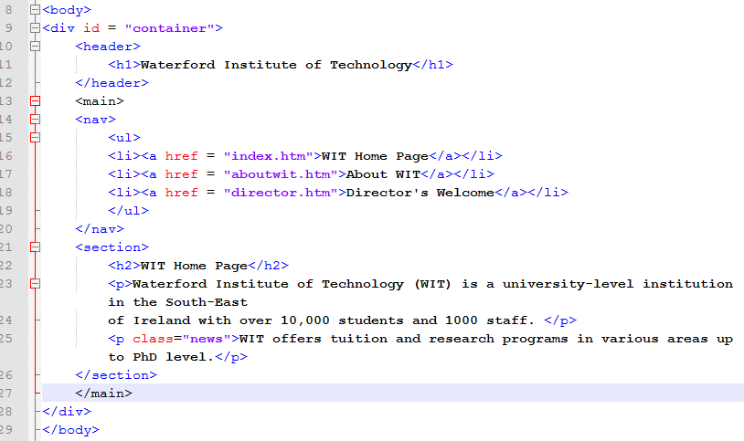

## Exercise One: WIT Website

In this practical we will add and style Structural Elements to enhance the look of our WIT website to look as follows:

Create a folder called Week 8. Download [lab01.zip](archives/lab01.zip) and extract it into the Week 8 folder.

- Modify the .htm files as follows:

  - After the opening `<body>` tag add a div called container (i.e. `
`).
  - Within the container div, add a header element. The opening header tag should be before the opening `<h1>` tag and the closing header tag should be after the closing `</h1>` tag.
  - Next, add a div (called main) to contain the navigation and section structural elements.
  - Add `<nav>` tags around the `<ul>` (the unordered list contains a list of links which are the navigation for the site.)
  - After the closing `</nav>` tag, put a `<section>` tag. The section element should surround the rest of the content on the page (the h2 heading and two paragraphs).
  - At the end of the page (before the closing `<body>` tag) including the closing tags for the section element, the main div and the container div (i.e.`</section>

`)
  - You will need to add these structural tags to all three of the HTML pages in the site: index.htm, director.htm and aboutwit.htm.
  - The finished HTML code should look like this:

- Add styles to the .css file

  - Add a background-color of #050845 to the body element in the CSS file.
  - Add the following styles to the container div.
    - background-color: #fdf8f2
    - margin: 3%
    - padding: 1%
  - Add a background colour of #256290 to the nav and header.
  - Add padding of 2em to the header.
  - Change the font colour property of the h1, a:link, and a:visited selectors to white.
  - The navigation structural element should be 13em wide and floated to the left.
  - The main div should have the overflow property set to auto. It should also have a top margin of 0.5em.
  - The section structural element should be moved in from the left by 14em using the margin-left property.
