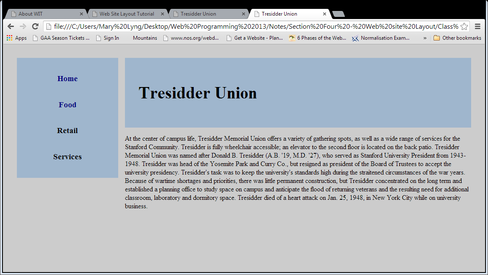
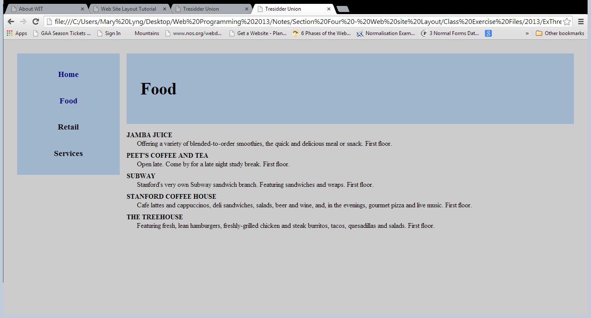
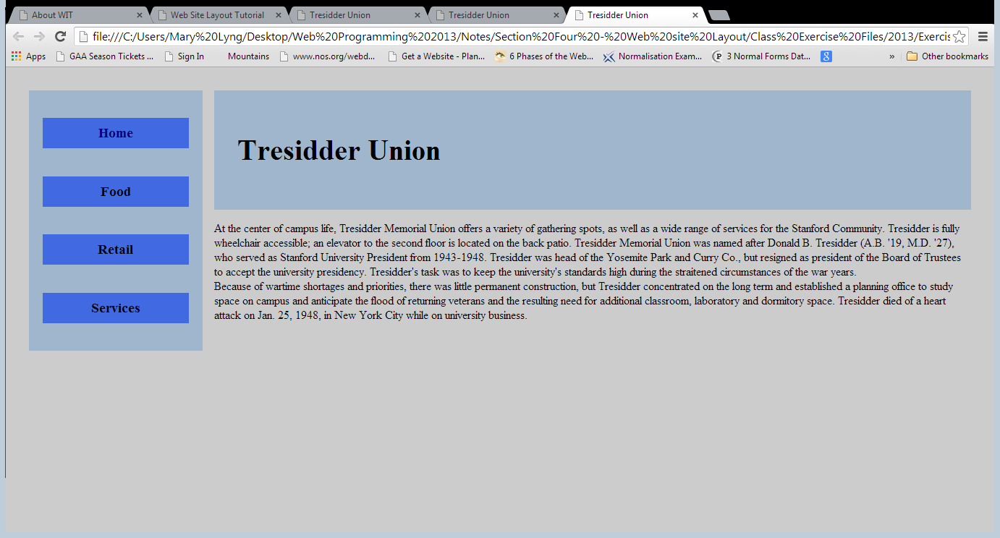

## Exercise Two: Tresidder Union Website

Download [lab02.zip](archives/lab02.zip) and extract it into the Week 8 folder.

Your objective for this exercise is to modify the Tresidder Union website. The website has four web pages: a home page, a food page, a retail page, and a services page. Each webpage will follow the very common left-hand sidebar, right-hand main page text design. Here’s a screenshot of the front webpage:

As you can see it consists of a left-hand navigation structural element, a header, and some information about Tresidder. The food, retail, and services web pages will list the various establishments in Tresidder.

Here’s a screenshot of the food web page:

The Retail and Services web pages should look almost exactly the same.

### Part A

Make the following changes to the HTML and CSS code to achieve this look for the Tresidder website:

- Edit each of the HTML files to include these elements:
  - A div called 'outer' that surrounds all of the content in the body section.
  - A header element (around the H1 element)
  - A nav element (surrounding the list of links)
  - A main element (enclosing the remaining content on each page)

- Add the following CSS styles to the exercise.css file
  - Add line height of 1.5em to the body selector.
  - The margin for the outer division is 2em.
  - The navigation is 15em wide, has a background colour of #9FB6CD, and is floated to the left.
  - The header and main structural elements have a left margin of 16em.
  - The header has a background colour of #9FB6CD, and has padding of 2em.
  - The h1 heading has a font size of 2.5em.
  - The paragraphs have justified alignment.
  - The unordered list has padding of 0 and the bullets are removed.
  - All the link items (nav li) are bold, have a font size of 1.2em; and are aligned to the center. They also have a top and bottom margin of 2em; and a left and right margin of 1em.
  - The nav li a:link pseudo-class is black and has no text decoration.
  - The nav li a:visited pseudo-class is navy and has no text decoration.
  - The nav li a:hover pseudo-class has a font colour of black and has text decoration of underline.
  - The nav li a:active pseudo-class has a background colour of white and a font colour of aqua.
  - The definition terms are bolded and converted to uppercase. They also have a top margin of .5em.
  - The definition detail items have a left margin of 1.5em. Line height is .75em.

### Part B

Modify the CSS file as follows:

  - Add a background colour of #4169E1 to the list items (nav li selector).
  - Add the following nav li a selector: width is 100%; top and bottom padding is .5em and left and right padding is 0; and the display is inline-block.
  - Modify the nav li a:hover selector by removing the text decoration property and adding a background colour of #2586d7.

