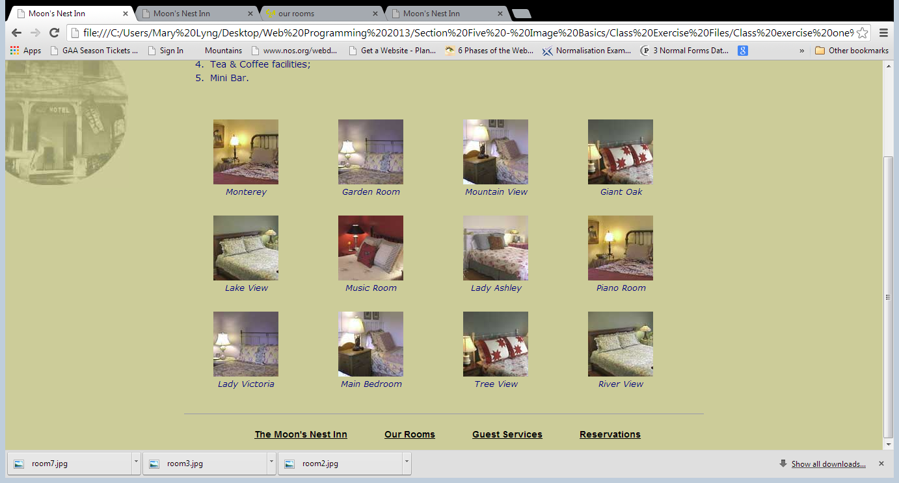
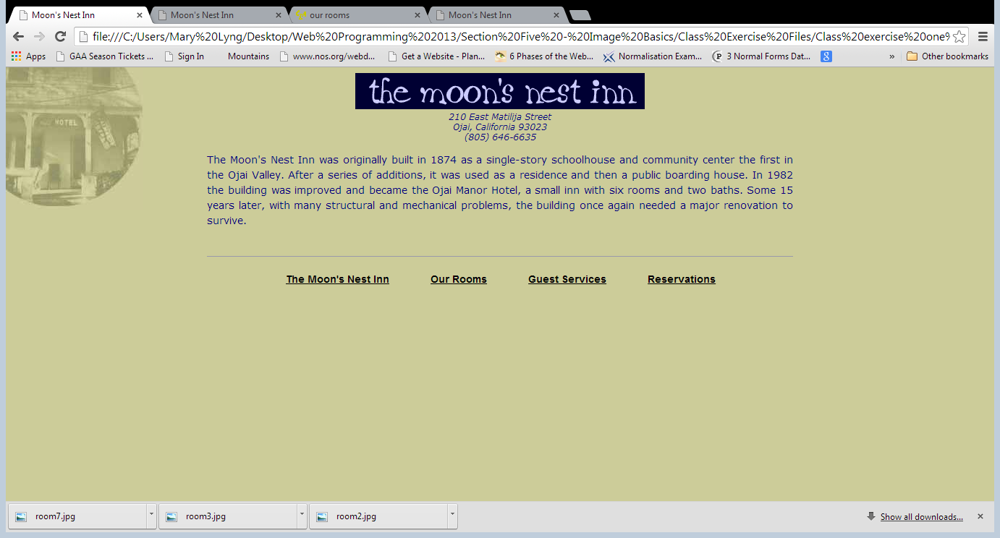

## Exercise: Moon's Nest Inn

Download [lab03.zip](archives/lab03.zip) and extract it into the Week 8 folder.

The Moon’s Nest Inn website contains four pages: index.htm (the home page), reserve.htm, rooms.htm and services.htm. We are going to add an image gallery to rooms.htm and also add a background image that will appear on each page in the site.

### Add image gallery to rooms.htm

- Add a `<figcaption>` tag after each room image. Use the text in the image's alt tag as the caption for the image (e.g. Monterey for the first image).
- Enclose each room image and `<figcaption>` inside a `<figure>` tag.
- Add css styling for the `<figure>` tag in the mycss.css file as follows:
  - Text alignment is centered.
  - Width is 7em.
  - Float the figure to the left.
- Add css styling for the `<figcaption>` tag in the mycss.css file as follows:
  - Font style is italic.
  - Font size is 90%.
- The result should look like this:

## Add a background image to appear on all pages in the site

- Add a background image (moon.jpg) to the web site; place it in the top left corner; and ensure that it is fixed.
- The result should look as follows:

