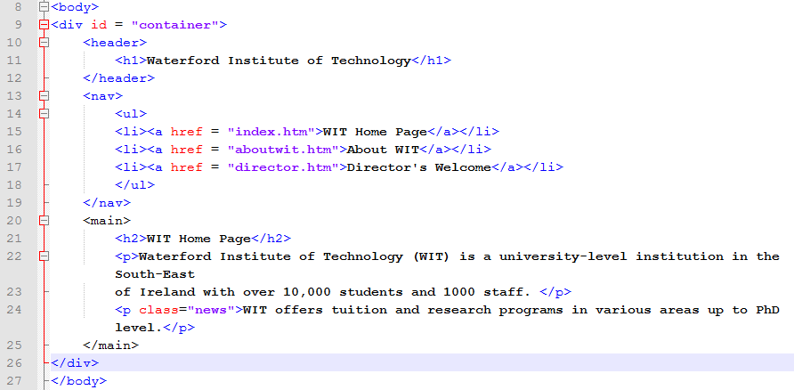

## WIT Website: Adding the HTML

In this lab we will add and style structural elements to create another look for our WIT website: a horizontal navigation menu that looks as follows:

Download [lab04.zip](archives/lab04.zip) and extract it into your Week 8 folder. (Don't continue with the same WIT website files that you worked with in Lab 01; instead, download lab04.zip and start fresh. We want to create a totally different layout for the site in this lab.)

Modify the .htm files as follows:

  - After the opening `<body>` tag add a div called container (i.e. `
`).
  - Within the container div, add a header element. The opening header tag should be before the opening `<h1>` tag and the closing header tag should be after the closing `</h1>` tag.
  - Add `<nav>` tags around the `<ul>` (the unordered list contains a list of links which are the navigation for the site.)
  - After the closing `</nav>` tag, put a `<section>` tag. The section element should surround the rest of the content on the page (the h2 heading and two paragraphs).
  - At the end of the page (before the closing `<body>` tag) including the closing tags for the section element and the container div (i.e.`</section>
`)
  - You will need to add these structural tags to all three of the HTML pages in the site: index.htm, director.htm and aboutwit.htm.
  - The finished HTML code should look like this:

