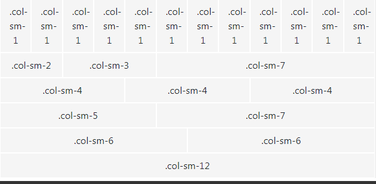
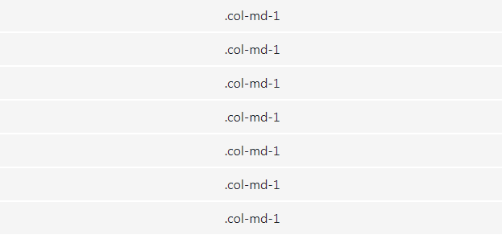

# Bootstrap Grid System
Grid systems enable you to create advanced layouts using rows and columns. The Bootstrap grid system can have up to 12 columns, 
and you can specify how these columns scale for different viewport sizes.

Here's an example of a Bootstrap grid:

The numbers at the end of each class name represent the number of columns that the column spans. 
So **.col-sm-1** spans one column and **.col-sm-8** spans eight. The **sm** means that the column span applies to small devices and 
everything above. You can also use **md**, **lg**, and **xl** for medium, large, and extra large.

Extra small devices are catered for by omitting the middle abbreviation. For example **.col-8** spans eight columns on 
extra small devices and up (in other words, all devices).

## Stacked to Horizontal

The following example uses the same markup, but this time we use **md** for **medium**. This means that, if the viewport is 
smaller than **medium** (i.e. less than 768 pixels), the cells in the grid will be stacked on top of each other, 
and each cell will take up the full width.

If you are viewing this on a wide screen, this example might not look any different to the previous one. 
However, if you resize your browser down, the cells will eventually shift into the stacked position (and the previous 
example will remain intact).

