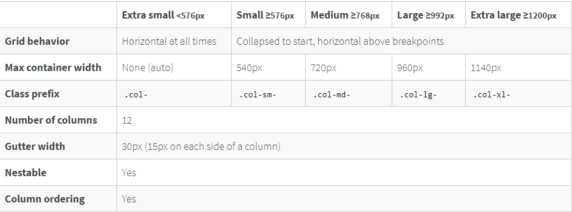

#Grid Sizes

The grid tier options are as follows:

- Extra small (**xs**) - below 576px
- Small (**sm**) - between 576px and 768px
- Medium (**md**) - between 768px and 992px
- Large (**lg**) - between 992px and 1200px
- Extra Large (**xl**) - over 1200px

The following table shows how different grid options work with different viewport sizes.
