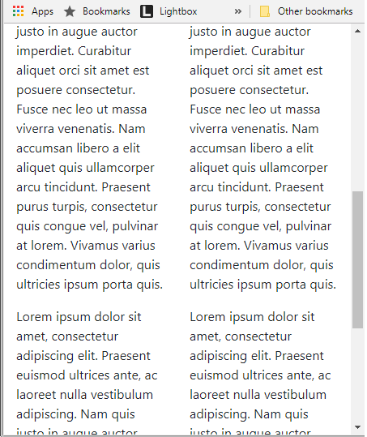

# Grid Exercises

- Download, extract and open the [lab01](archives/lab01.zip) folder in Week09.
- A web page has been created for you, add Bootstrap 4 code that will size the screen for very small viewports (and upwards) as follows:

You will notice that when you resize the browser to small viewport size, the 4 columns of text appear
very narrow. 

- Adjust the code for the 4 columns such that the columns of text are size 6 on very small viewports, and size 3 on small screens (and upwards).

