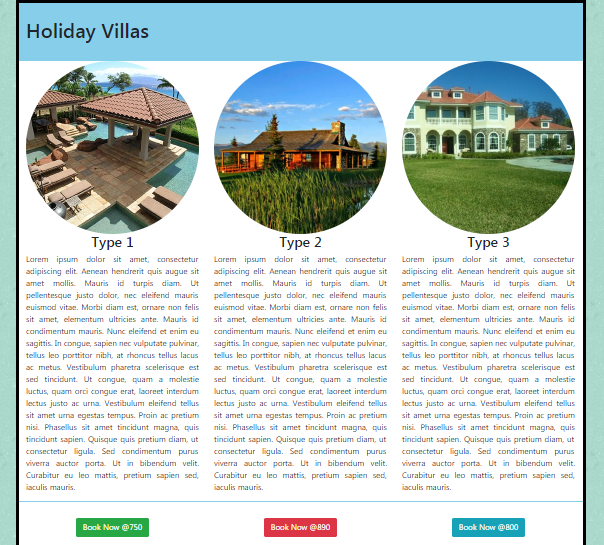

# Grid Exercise Two

- Download, extract and open the [lab02](archives/lab02.zip) folder in Week09.
- A web page has been created for you, add 3 images from the images folder (feat1.jpg, feat2.jpg, and feat3.jpg), which are responsive and displayed as a circle.
- Add Bootstrap 4 code that will size the screen for very small viewports (and upwards) as follows:

- The headings (Type 1, Type 2, and Type 3) are centered. 
- The paragraphs are justified.
- In the footer, add 3 buttons (Go to <a href="https://v4-alpha.getbootstrap.com/components/buttons/#examples" target="_blank">Buttons</a>).
