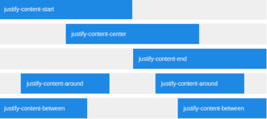

#Offsetting Columns

The **justify-content** property, allows us to horizontally position elements in a row.

In the following <a href="archives/Class Htmls/ex5.html" target="_blank">example</a>, we have a column sized (**col-sm-8**) and it is centered
using the **justify-content-center** property.
~~~

  

   
...

  

~~~
