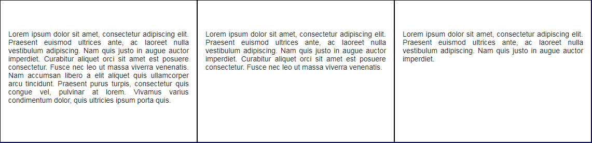

# Column Height

In Bootstrap 4 flexbox layouts all cells in a row are aligned to be as tall as the column with most content as in the 
following <a href="archives/class htmls/ex8.html" target="_blank">example</a>.

<!--## Vertical Alignment
Bootstrap 4 flexbox is great at layout alignment and gives us not one, but two ways to vertically position columns:

### Vertically align the whole row:
~~~

    
Middle

  

    
Bottom

    
Top

~~~

### Align individual columns within the row:
~~~

    
Top

    
Middle

    
Bottom

~~~
-->