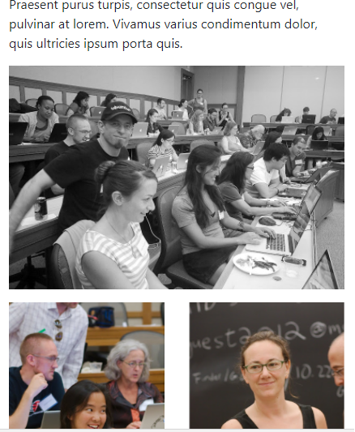

# Grid Exercises

- Download, extract and open the [lab03](archives/lab03.zip) folder in Week09.
- A web page has been created for you, add Bootstrap 4 code that will size the screen for small (tablet) viewports (and upwards) as follows:

- Style the webpage for tablet (col-sm-* ).
- The heading takes up the full 12 columns.
- The content section is split in 2; the textual content takes up 8 columns and the images take up the 4 remaining columns.
- You will be required to nest the second column to render the second and third images under the first image.

When the screen is reduced to the smallest viewport, the content will be fluid but the images should render the second and third images under the first image.

