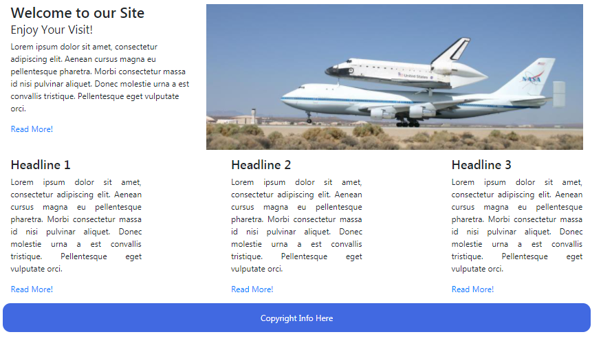

# Grid Exercise Two

- Download, extract and open the [lab04](archives/lab04.zip) folder in Week09.
- A web page has been created for you. Add the necessary tags to render index.html as follows when the screen 
viewport is at large viewport or larger:

**Notes:** 

- The image has a higher order when the viewport is larger (or greater).
- The content in the 3 columns are size 3 and are the using  one of the justify-content-? propertiesy to render the first and 
last columns at each edge with equal space in between.
- The text in the 3 columns are justified and the text in the footer is centered.

Now, adjust the necessary tags to render index.htm as follows when the screen viewport is at laptop viewport:

