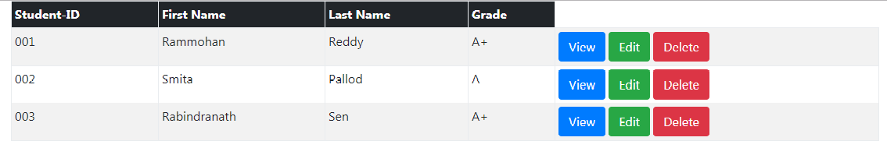

# Table and Button Exercise

- Download, extract and open the [lab01](archives/lab01.zip) folder in Week10.
- A web page with a table has been created for you, add Bootstrap 4 table classes that will:

 1. Stripe the table.
 2. Add a hover.
 3. Add a border.
 4. Condense the table.
 5. Style the table head (dark).

- Add 3 buttons with the classes as in the image below for each row with the respective labels: View, Edit, Delete.

