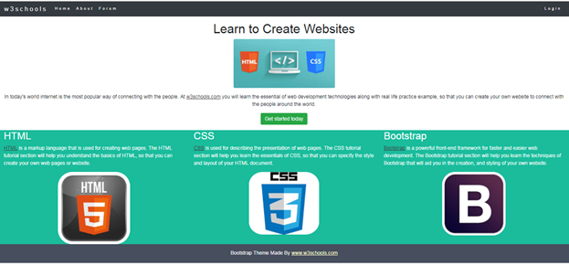
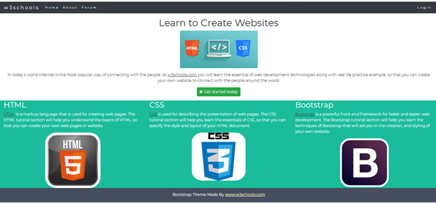

# Exercise

##Part One

- Download, extract and open the [lab03](archives/Lab03.zip) folder in Week10.
- A web page has been created for you, add Bootstrap 4 classes that will:

 1. Add a responsive Navbar (with the options in the screenshot).
    1. The navbar is dark and the background colour is dark also.
    2. Add padding to the y axis (top and bottom) of 1.
    3. Expand to md.
    4. The brand is w3Schools. 
 2. For the first container:
    1. Center the text.
    2. Add top padding of 3 to the h1.
    3. The image should be rounded and responsive.
    4. Add a button (success) to the link for Get Started.
 3. For the second container:
    1. Apply the bg-1 class.
    2. There are 3 even columns.
    3. The div surrounding the image in each column is centered.
    4. Each image is responsive and has the class margin applied.
 4. For the third container:
    1. Apply the bg-2 class.
    2. Add top padding of 3 and bottom padding of 1.
    3. Center the text.
-

## Part Two

### Font

Personalise your Theme by adding a font that you like. We will use "Montserrat" from Google's Font Library.

- Link to the font in the **&lt;head&gt;** section:
~~~
<link href="http://fonts.googleapis.com/css?family=Montserrat" rel="stylesheet">
~~~

- Then you can use it in the page by modifying the **&lt;body&gt;** style as follows:
~~~
body {
  font-family: Montserrat, sans-serif;
  line-height: 1.5;
}
~~~
You can find out more at: <a href="https://developers.google.com/fonts/docs/getting_started?hl=en" target="_blank">Get Started with the Google Fonts API</a>

### Icon
Here, we will add an icon to the search button:

- Link to the icon in the **&lt;head&gt;** section:
~~~
  <link href="https://maxcdn.bootstrapcdn.com/font-awesome/4.5.0/css/font-awesome.min.css" rel="stylesheet">
~~~

Add the following to the link (Get Started Today) before the label:
~~~

~~~

You can find out more at: <a href="http://fontawesome.io/" target="_blank">Font Awesome</a>

