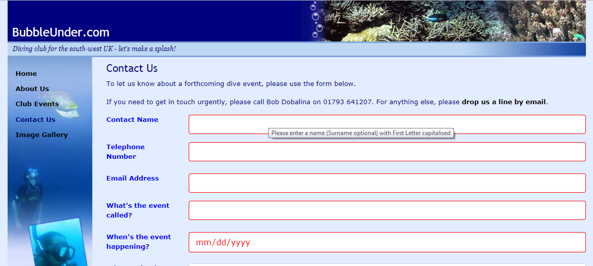

# Part Two

Using the form from Part One, you now need to add some attributes for some of the elements:

- Contact Name: 
  - Focus when form loads
  - Mandatory
  - Add a pattern to allow only a valid name (with optional second name, and more names...). First letter capitalised, followed by at least 1 lowercase letter. 
  - Add a suitable error message
- Telephone Number:
  - Mandatory
  - Add a pattern to allow only valid telephone numbers.
  - Add a suitable error message
- Email Address:
  - Mandatory
  - Add a pattern to allow only valid email addresses.
  - Add a suitable error message
- Event Name:
  - Mandatory
  - Add a pattern to allow at least 3 characters.
  - Add a suitable error message
- Event Date
  - Mandatory
  - Add a suitable error message
 
 
 